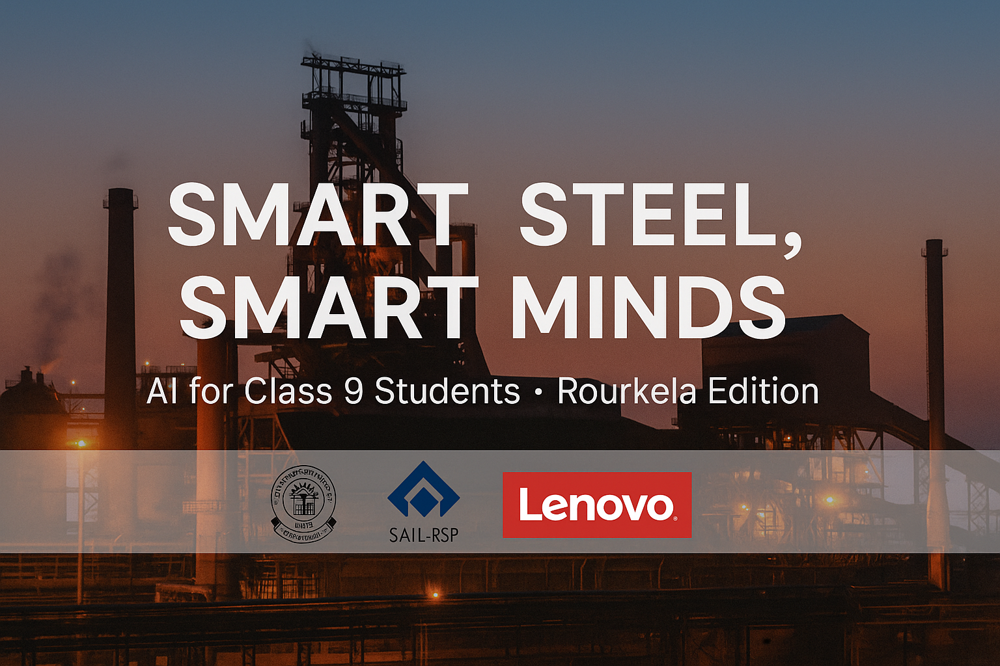

# 🏗️ Smart Steel, Smart Minds – Rourkela Edition

<p align="center">
  
</p>


This is a simple Python + AI learning folder for Class 9 students (CBSE AI Code 417) built around **Rourkela Steel Plant (RSP)** and the role of steel in our lives.

## 🚀 How to Run
1. Install Python 3.8+  
2. Open a terminal in this folder  
3. Run any script:
   ```bash
   python hello_rourkela.py
   python steel_quiz.py
   python smart_steel_tracker.py

